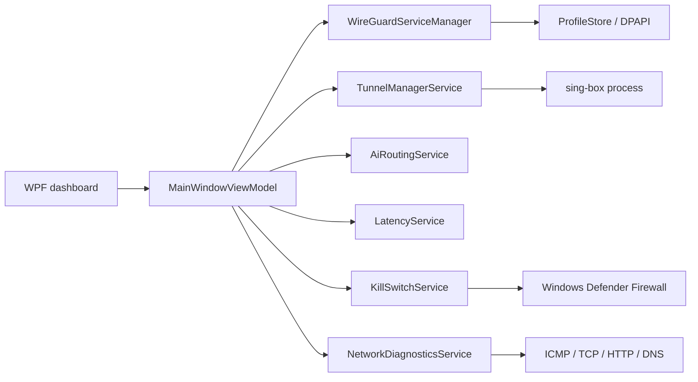

# Starlink VPN Manager

<p align="center">
  
  
  
  <a href="https://github.com/rostamimohammadamin8-dot/starlink-vpn-manager/actions/workflows/dotnet.yml"></a>
  <a href="https://github.com/rostamimohammadamin8-dot/starlink-vpn-manager/stargazers"></a>
</p>

A Windows desktop app for securely managing WireGuard profiles, monitoring network quality, and running sing-box tunnels with optional AI-service routing. The interface is currently Persian-language and built with WPF on .NET 8.

> **Project status:** WireGuard profile management, diagnostics, sing-box tunnel launch, AI bypass rules, and optional Windows Firewall kill switch are implemented. Starlink outage failover and per-application split tunneling are roadmap items, not current capabilities.

## Features

- **WireGuard profiles:** Import `.conf` files, install and manage Windows tunnel services, view peer handshake and transfer status, and remove profiles.
- **Smart AI bypass:** Add sing-box route rules for OpenAI/ChatGPT, Anthropic/Claude, Google Gemini, Midjourney, and Hugging Face. Rules use a configured `direct` outbound and can also include caller-supplied IP CIDRs.
- **sing-box tunnels:** Select a sing-box JSON configuration and start/stop `sing-box.exe`. The app writes a temporary merged runtime configuration under the current user's Local AppData; the selected source file is not overwritten.
- **Network diagnostics:** Concurrent ICMP, TCP-handshake, and HTTP-response probes, endpoint DNS resolution, raw latency reporting, and a transport-probe success score.
- **Optional kill switch:** With explicit confirmation and Windows administrator approval, block system-wide outbound traffic except traffic on the identified VPN interface and to the configured VPN server IPs. Existing outbound allow rules and firewall profile defaults are saved for restoration. The app refuses activation if it detects an enforced outbound allow policy it cannot safely contain.
- **DPAPI profile security:** Imported WireGuard configurations are encrypted with Windows DPAPI for the current user. The app never displays private keys in diagnostics.
- **Live connection log:** Process output, tunnel activity, latency measurements, and errors are shown in the dashboard.

### Roadmap

- **Starlink outage failover:** Detect a Starlink/WAN outage and transition to a configured backup connection.
- **App-based split tunneling:** Select applications whose traffic should use or bypass a tunnel.

These features are not currently implemented; no automatic WAN failover or per-application routing is performed.

## Quick Start

### Requirements

- Windows 10 or 11
- [.NET 8 SDK](https://dotnet.microsoft.com/download/dotnet/8.0) to build and run from source
- [WireGuard for Windows](https://www.wireguard.com/install/) for WireGuard profile management
- `sing-box.exe` beside the application or available on `PATH` to use sing-box profiles

### Build and run

```powershell
git clone https://github.com/rostamimohammadamin8-dot/starlink-vpn-manager.git
cd starlink-vpn-manager
dotnet build .\StarlinkVpnManager\StarlinkVpnManager.csproj
dotnet run --project .\StarlinkVpnManager\StarlinkVpnManager.csproj
```

Import a WireGuard `.conf` profile, or select a sing-box JSON configuration from the dashboard. A valid VPN configuration and service credentials are not provided by this project.

## Kill Switch Safety

The kill switch is **off by default**. Enabling it changes the outbound policy for the Windows Domain, Private, and Public firewall profiles and requires an explicit confirmation followed by a UAC approval. To keep a full-tunnel VPN working, it permits outbound traffic on the detected WireGuard/sing-box tunnel interface and permits the resolved VPN server IP addresses for tunnel recovery. It disables existing locally managed outbound allow rules while active, then restores the saved firewall defaults and those rules when protection is switched off.

If another enforced firewall policy still allows untrusted outbound traffic, activation is rejected and the prior local firewall configuration is restored. If the app or tunnel exits unexpectedly while protection is active, the block deliberately remains in place. Reopen the app and turn **Kill Switch Protection** off to restore the saved settings. Split-tunnel configurations may not work with the current interface-wide allow rule; the protection is designed for a recognized full-tunnel interface.

If the app cannot be opened to restore the settings, run this recovery in **PowerShell as Administrator** for the same Windows user:

```powershell
$statePath = Join-Path $env:LOCALAPPDATA 'StarlinkVpnManager\kill-switch-state.json'
$state = Get-Content -LiteralPath $statePath -Raw | ConvertFrom-Json
foreach ($profile in @($state.Profiles)) {
    Set-NetFirewallProfile -Profile $profile.Name -DefaultOutboundAction $profile.DefaultOutboundAction
}
foreach ($ruleName in @($state.EnabledOutboundRuleNames)) {
    Enable-NetFirewallRule -Name $ruleName -ErrorAction SilentlyContinue
}
Remove-NetFirewallRule -Group 'StarlinkVpnManager Kill Switch' -ErrorAction SilentlyContinue
Remove-Item -LiteralPath $statePath -Force
```

## Architecture



The WPF entry point is `StarlinkVpnManager/App.xaml`; the dashboard is in `StarlinkVpnManager/Views/`. Services and the view model live under `Services/` and `ViewModels/`. WireGuard profile metadata and encrypted configuration are stored under the current user's Local AppData.

## Configuration Notes

- AI bypass rules are inserted before catch-all sing-box route rules and target the configured outbound tag (default: `direct`). The referenced outbound must exist in the selected configuration.
- Domains are represented as `domain_suffix` values, so subdomains such as `api.openai.com` match their provider rule.
- IP CIDRs can be supplied to `AiRoutingService`; no provider IP ranges are hard-coded because those ranges may change.
- Network diagnostics do not change routes, MTU, firewall settings, or VPN configuration. The stability score is the percentage of the repeated TCP/HTTP probes that received a response; it is an indicator for those tested destinations, not a guarantee of end-to-end VPN health.
- WireGuard source profiles are DPAPI-protected. A sing-box source configuration remains at its chosen location; when AI routing is enabled, the generated runtime copy can contain the same credentials and is kept in the current user's Local AppData until the tunnel stops.

## License

No license has been declared in this repository yet. Until one is added, do not assume the source is available for reuse or redistribution.
